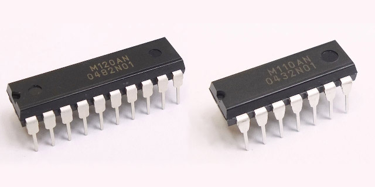

R8C
=========


R8C sources 

## R8C 各ディレクトリー、及び概要など
   
これは R8C と、そのコンパイラである m32c-elf-gcc,g++ によるプログラムです。   
   
現在は、主に「R5F2M110ANDD」及び「R5F2M120ANDD」に対応した、ヘッダー、関連ライブラリーなどです。   
   
※R8C/M110AN、R8C/M120AN   
   
※M110AN、M120AN は通常、プログラムエリア２キロバイト、ワークエリア２５６バイトのデバイスですが、   
実際は、プログラムエリア６４キロバイト、ワークエリア１３６６バイトを保有していて、フラッシュライター   
の制御ファイルを修正する事で、全領域を利用する事が可能です。（ロットにより異なる場合があると考えられる）   
現在では、Windows、OS-X、Linux (Ubuntu-64) で動作確認が済んだ、専用書き込みプログラムも実装して   
あり、色々な環境で、開発が出来るようになっています。   
   
プロジェクトは、Makefile、及び、関連ヘッダー、ソースコードからなり、専用のスタートアップルーチン、   
リンカースクリプトで構成されています。   
その為、専用のブートプログラムやローダーは必要なく、作成したバイナリーをそのまま実行できます。   
   
デバイスＩ／Ｏ操作では、C++ で構成されたクラスライブラリーを活用出来るように専用のヘッダーを用意   
してあり、各種デバイス用の小さなクラスライブラリーの充実も行っています。   

## R8C プロジェクト・リスト

 - /r8cprog         --->   R8C フラッシュへのプログラム書き込みツール（Windows、OS-X、※Linux 対応）
 - /M120AN          --->   M120AN,M110AN デバイス、Ｉ／Ｏポート定義
 - /chip            --->   チップ固有ヘッダー
 - /common          --->   R8C 共有クラス、小規模なクラスライブラリーなど
 - /pfatfs          --->   ぷち FatFS 関係ソース、ヘッダー
 - /FIRST_sample    --->   ＬＥＤ点滅サンプル
 - /UART_sample     --->   シリアルインターフェースの送信、受信サンプル
 - /TIMER_sample    --->   タイマーＲＢのサンプル（インターバルタイマー）
 - /ADC_sample      --->   Ａ／Ｄ変換のサンプル
 - /DATA_FLASH_sample --->   データフラッシュの初期化、リード、ライト
 - /PWM_sample        --->   タイマーＲＣのサンプル（ＰＷＭ出力）
 - /RC_SERVO_sample --->   ラジコン用サーボの動作テスト（ＰＷＭ、２出力）
 - /COMP_sample     --->   コンパレーターのサンプル
 - /DS1371_sample   --->   I2C RTC デバイスのサンプル（DS1371）
 - /DS3231_sample   --->   I2C RTC デバイスのサンプル（DS3231）
 - /EEPROM_sample   --->   I2C EEPROM デバイスのテスト
 - /SWITCH_sample   --->   スイッチ入力テスト（チャタリング除去とトリガー判定）
 - /ENCODER_sample  --->   エンコーダー入力テスト
 - /PLUSE_OUT_sample --->   タイマーＲＪを使ったパルス出力テスト
 - /PLUSE_INP_sample --->   タイマーＲＪを使った周波数計測テスト
 - /PLUSE_OUT_LCD   --->   タイマーＲＪ、ＬＣＤ、エンコーダ
 - /LCD_test        --->   128x32 mono color graphics のテスト
 - /SD_test         --->   pFatFS を使った、SD カードのテスト
 - /SD_monitor      --->   pFatFS を使った、SD カードのモニター
 - /SD_WAV_play     --->   SD カード上の WAV 形式ファイルの PWM 再生
 - /ARITH_sample    --->   数値計算テンプレートサンプル

---

## R8C 開発環境準備（Windows、MSYS2）
   
 - Windows では、事前に MSYS2 環境をインストールしておきます。
 - MSYS2 には、msys2、mingw32、mingw64 と３つの異なった環境がありますが、msys2 で行います。 
   
 - msys2 のアップグレード

```
   pacman -Sy pacman
   pacman -Syu
```

 - コンソールを開きなおす。（コンソールを開きなおすように、メッセージが表示されるはずです）

```
   pacman -Su
```
 - アップデートは、複数回行われ、その際、コンソールの指示に従う事。
 - ※複数回、コンソールを開きなおす必要がある。

 - gcc、texinfo、gmp、mpfr、mpc、diffutils、automake、zlib tar、make、unzip コマンドなどをインストール
```
   pacman -S gcc
   pacman -S texinfo
   pacman -S mpc-devel
   pacman -S diffutils
   pacman -S automake
   pacman -S zlib
   pacman -S tar
   pacman -S make
   pacman -S unzip
   pacman -S zlib-devel
```
  
 - git コマンドをインストール
```
   pacman -S git
```

---

## R8C 開発環境準備（OS-X）

 - OS-X では、事前に macports をインストールしておきます。（brew は柔軟性が低いのでお勧めしません）
 -  OS−X のバージョンによっては、事前にX−Code、Command Line Tools などのインストールが必要になるかもしれません）

 - macports のアップグレード

```
   sudo port -d self update
```

 - ご存知とは思いますが、OS−X では初期段階では、gcc の呼び出しで llvm が起動するようになっています。
 - しかしながら、現状では llvm では、gcc のクロスコンパイラをビルドする事は出来ません。
 - そこで、macports で gcc をインストールします、バージョンは５系を使う事とします。
```
   sudo port install gcc5
   sudo ln -sf /opt/local/bin/gcc-mp-5  /usr/local/bin/gcc
   sudo ln -sf /opt/local/bin/g++-mp-5  /usr/local/bin/g++
   sudo ln -sf /opt/local/bin/g++-mp-5  /usr/local/bin/c++
```
 - 再起動が必要かもしれません。
 - 一応、確認してみて下さい。
```
   gcc --version
```
   
```
   gcc (MacPorts gcc5 5.4.0_0) 5.4.0
   Copyright (C) 2015 Free Software Foundation, Inc.
   This is free software; see the source for copying conditions.  There is NO
   warranty; not even for MERCHANTABILITY or FITNESS FOR A PARTICULAR PURPOSE.
```
   
 - texinfo、gmp、mpfr、mpc、diffutils、automake コマンドなどをインストール
```
   sudo port install texinfo
   sudo port install gmp
   sudo port install mpfr
   sudo port install libmpc
   sudo port install diffutils
   sudo port install automake
```

---
## RL78 開発環境準備（Ubuntu）

Linux 環境は、複数あるので、ここでは「Ubuntu 16.04 LTS」環境の場合を書いておきます。

 - texinfo、gmp、mpfr、mpc、diffutils、automake コマンドなどをインストール
```
   sudo apt-get install texinfo
   sudo apt-get install libgmp-dev
   sudo apt-get install libmpfr-dev
   sudo apt-get install libmpc-dev
   sudo apt-get install diffutils
   sudo apt-get install automake
   sudo apt-get install zlib1g-dev
```

---
## R8C 開発環境構築

 - R8C は M32C のサブセット版ですので、M32C 用 gcc を構築します。
 - R8C 用コンパイラ（m32c-elf-gcc,g++）は gcc-4.9.4 を使います。
 - binutils-2.25.1.tar.gz をダウンロードしておく
 - gcc-4.9.4.tar.gz をダウンロードしておく
 - newlib-2.2.0.tar.gz をダウンロードしておく
   
---
   
#### binutils-2.25.1 をビルド
```
   cd
   tar xfvz binutils-2.25.1.tar.gz
   cd binutils-2.25.1
   mkdir m32c_build
   cd m32c_build
   ../configure --target=m32c-elf --prefix=/usr/local/m32c-elf --disable-nls --with-system-zlib
   make
   make install     OS-X,Linux: (sudo make install)
```

 -  /usr/local/m32c-elf/bin へパスを通す（.bash_profile を編集して、パスを追加）

```
   PATH=$PATH:/usr/local/m32c-elf/bin
```

 -  コンソールを開きなおす。

```
   m32c-elf-as --version
```

 -  アセンブラコマンドを実行してみて、パスが有効か確かめる。
  
#### C コンパイラをビルド
```
    cd
    tar xfvz gcc-4.9.4.tar.gz
    cd gcc-4.9.4
    mkdir m32c_build
	cd m32c_build
    ../configure --prefix=/usr/local/m32c-elf --target=m32c-elf --enable-languages=c --disable-libssp --with-newlib --disable-nls --disable-threads --disable-libgomp --disable-libmudflap --disable-libstdcxx-pch --disable-multilib --enable-lto --with-system-zlib
    make
    make install     OS-X,Linux: (sudo make install)
```
  
#### newlib をビルド
```
    cd
    tar xfvz newlib-2.2.0.tar.gz
	cd newlib-2.2.0
    mkdir m32c_build
    cd m32c_build
    ../configure --target=m32c-elf --prefix=/usr/local/m32c-elf
	make
    make install     OS-X: (sudo make install)
```
 - Linux 環境では、sudo コマンドで、ローカルで設定した binutils のパスを認識しないので、
「make install」が失敗する、その為、以下のようなスクリプトを書いて実行する。
```
#!/bin/sh

PATH=${PATH}:/usr/local/m32c-elf/bin
make install
```
   
```
    sudo m32c_install.sh
```
  
---  
#### C++ コンパイラをビルド
```
    cd
    cd gcc-4.9.4
    cd m32c_build
    ../configure --prefix=/usr/local/m32c-elf --target=m32c-elf --enable-languages=c,c++ --disable-libssp --with-newlib --disable-nls --disable-threads --disable-libgomp --disable-libmudflap --disable-libstdcxx-pch --disable-multilib --enable-lto --with-system-zlib
    make
    make install     OS-X,Linux: (sudo make install)
```
   
---
   
## R8C プロジェクトのソースコードを取得

```
   git clone git://github.com/hirakuni45/R8C.git
```
   
 - プロジェクトを全てコンパイル
```
   sh all_project_build.sh
```
   
--- 
   
## R8C/M120AN, R8C/M110AN デバイスへのプログラム書き込み方法

幾つかの方法がありますが、最も簡単で、コストがかからない方法は、シリアルインターフェースを使って
書き込む方法です。   
   
シリアルインターフェースからの２つの信号をマイコンと接続する必要があります。   
※USB シリアル変換モジュールなどを使うと、電源も取れて簡単です。   
※（秋月電子、シリアル変換モジュール）http://akizukidenshi.com/catalog/g/gK-06894/   
(1) RXD シリアル受信   
(2) TXD シリアル送信   
(3) VCC 電源（５Ｖ又は３．３Ｖ）   
(4) GND 電源 ０Ｖ   
※３．３Ｖは限られた電流しか取り出せない為、レギュレーターを入れる事を推奨します。   
※中国製の格安なモジュールは、品質が安定していない為、お勧めしません、それらの事
項を理解していて対処出来る人だけ利用すると良いと思います。
   
 - 誤解しやすい事項として、R8C で標準的に使う UART の接続とは一部異なっている点です。
 - 回路図は、r8cprog/KiCAD/ を参照して下さい、標準的接続回路があります。   
 - もちろん、ルネサスエレクトロニクス販売のＥ１、又は、Ｅ２、エミュレーターでも書き込む事が出来ます。
 - シリアル通信は、開発過程では良く利用するので、スイッチで切り替えられるようにしておくと便利です。   
※切り替えの参考回路が、「r8cprog/KiCAD」にあります。   

---
   
## R8C フラッシュプログラマーの構築

 - 以下は、まだ未完、実装中です・・・・・
 - ※ Renesas Flash Programmer の最新版を使って下さい。
 - r8c_prog のビルドには「boost_1_60_0」が必要です。
 - boost はヘッダーのみ利用なので、ビルドの必要はありません、boost_1_60_0.zip を展開するだけです。
 - 又は、mingw64 環境などに pacman を使い boost をインストールして、そのパスを設定しても良いでしょう。

 - boost の展開は、MSYS2（Windows）の場合だけ必要です。
``` 
    cd /usr/local
    unzip boost_1_60_0.zip
```

 - r8c_prog のビルド（MSYS2）
 - ビルドした実行ファイルは、~/bin 又は、/usr/local/bin に配置します。

```
    cd r8cprog
    make
    mkdir ~/bin
    cp r8c_prog.exe ~/bin/.
    cp r8c_prog.conf ~/bin/.
　　※~/bin にパスを通しておく。
```
 - r8c_prog.conf を編集して、接続する COM ポート、ボーレートの設定をする。
 - /dev/ttyS10 -> COM11 に相当します。（数字に＋１する）
 - OS-X では、/dev/tty.usbserial-xxxxxxxxxx などのデバイス名になります。
 - Linux では、/dev/ttyUSB[0 to 9] などのデバイス名になります。
 - Linux では、シリアルデバイスのパーミッションが、標準では設定されていないので、変更します。   
 - r8cprog/KiCAD/ に、R8C プログラマー（書き込み機）の参考回路などが含まれます。
  
---
   
## 各プロジェクトの動作

 - 各プロジェクトのリストを参考に、プロジェクトのディレクトリーに移動します。

 - ビルドします。（自動で、従属規則が生成されます）
```
    make
```

 - プログラムの書き込み（r8c_prog が必要）
```
    make run
```

License
----

MIT
