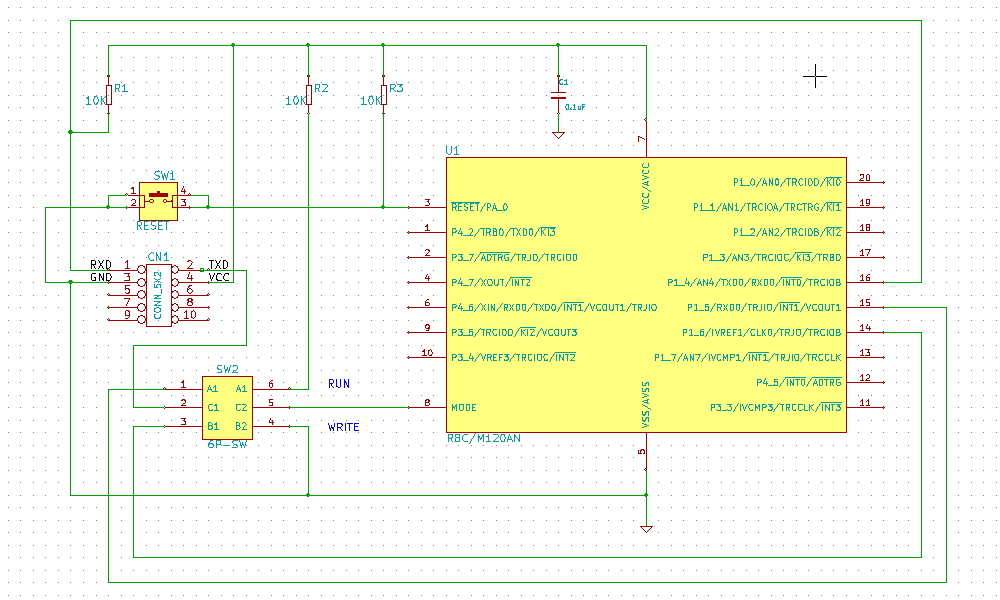
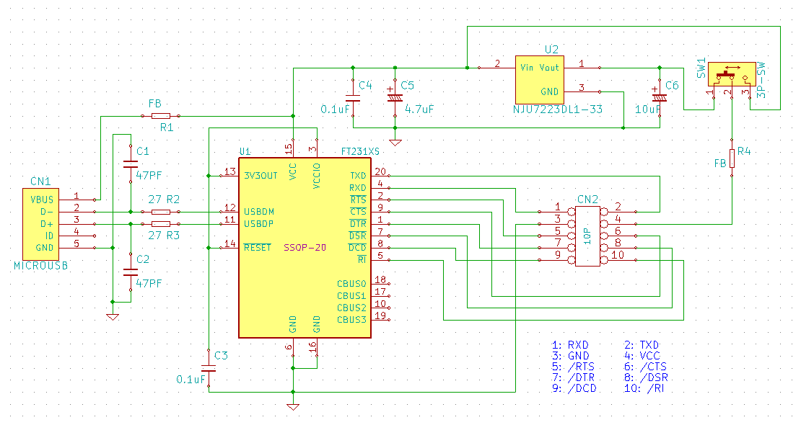

R8C/M120AN R8C/M110AN
=========


R8C sources 

## R8C 各ディレクトリー、及び概要など
   
これは R8C と、そのコンパイラである m32c-elf-gcc,g++ によるプログラムです。   
   
現在は、主に「R5F2M110ANDD」及び「R5F2M120ANDD」に対応した、ヘッダー、関連ライブラリーなどです。   
   
※R8C/M110AN、R8C/M120AN   
   
※M110AN、M120AN は通常、プログラムエリア２キロバイト、ワークエリア２５６バイトのデバイスですが、   
実際は、プログラムエリア６４キロバイト、ワークエリア１３６６バイトを保有していて、フラッシュライター   
の制御ファイルを修正する事で、全領域を利用する事が可能です。（ロットにより異なる場合があると考えられる）   
現在では、Windows、OS-X、Linux (Ubuntu-64) で動作確認が済んだ、専用書き込みプログラムも実装して   
あり、色々な環境で、開発が出来るようになっています。   
   
プロジェクトは、Makefile、及び、関連ヘッダー、ソースコードからなり、専用のスタートアップルーチン、   
リンカースクリプトで構成されています。   
その為、専用のブートプログラムやローダーは必要なく、作成したバイナリーをそのまま実行できます。   
   
デバイスＩ／Ｏ操作では、C++ で構成されたテンプレートクラスライブラリーを活用出来るように専用のヘッダーを用意   
してあり、各種デバイス用の小さなクラスライブラリーの充実も行っています。   

## R8C プロジェクト・リスト

|プロジェクト(DIR)|詳細|
|---|---|
|[r8cprog](/r8cprog)|R8C フラッシュへのプログラム書き込みツール（Windows、OS-X、※Linux 対応）|
|[M120AN](/M120AN)|M120AN,M110AN デバイス、Ｉ／Ｏポート定義テンプレートクラス|
|[chip](/chip)|I2C、SPI、専用チップ、IC 固有テンプレートクラス|
|[common](/common)|R8C 共有クラス、小規模なクラスライブラリーなど|
|[pfatfs](/pfatfs)|ぷち FatFS 関係ソース、ヘッダー|
|[FIRST_sample](/FIRST_sample)|ＬＥＤ点滅サンプル|
|[UART_sample](/UART_sample)|シリアルインターフェースの送信、受信サンプル|
|[TIMER_sample](/TIMER_sample)|タイマーＲＢのサンプル（インターバルタイマー）|
|[SWITCH_sample](/SWITCH_sample)|スイッチ入力テスト（チャタリング除去とトリガー判定）|
|[ENCODER_sample](/ENCODER_sample)|ロータリーエンコーダー、カウント、サンプル|
|[ADC_sample](/ADC_sample)|Ａ／Ｄ変換のサンプル|
|[THERMISTOR_sample](/THERMISTOR_sample)|サーミスターを使った温度検出、サンプル（A/D 利用）|
|[DATA_FLASH_sample](/DATA_FLASH_sample)|データフラッシュの初期化、リード、ライト|
|[PWM_sample](/PWM_saple)|タイマーＲＣのサンプル（ＰＷＭ出力）|
|[RC_SERVO_sample](/RC_SERVO_sample)|ラジコン用サーボの動作テスト（ＰＷＭ、２出力）|
|[PLUSE_OUT_sample](/PLUSE_OUT_sample)|タイマーＲＪを使ったパルス出力テスト|
|[PLUSE_INP_sample](/PLUSE_INP_sample)|タイマーＲＪを使った周波数計測テスト|
|[COMP_sample](/COMP_sample)|コンパレーターのサンプル|
|[DS1371_sample](/DS1371_sample)  |I2C RTC デバイスのサンプル（DS1371）|
|[DS3231_sample](/DS3231_sample)  |I2C RTC デバイスのサンプル（DS3231）|
|[EEPROM_sample](/EEPROM_sample)  |I2C EEPROM デバイスのテスト|
|[VL53L0X_sample](/VL53L0X_sample) |I2C VL53K0X レーザー距離センサのサンプル|
|[MPU6050_sample](/MPU6050_sample) |I2C MPU6050 加速度、ジャイロ、センサー、サンプル|
|[BMP180_sample](/BMP180_sample)  |I2C Bosh BMP180 温度、標高、センサー、サンプル |
|[TOUCH_sample](/TOUCH_sample)   |タッチスイッチのテスト|
|[PLUSE_OUT_LCD](/PLUSE_OUT_LCD)  |タイマーＲＪ、ＬＣＤ、エンコーダ|
|[MAX7219_sample](/MAX7219_sample) |SPI LED ディスプレイ・ドライバー、サンプル|
|[MAX6675_sample](/MAX6675_sample) |SPI 接続、ｋ熱電対温度センサー、サンプル|
|[ARITH_sample](/ARITH_sample)   |文字列による計算式、評価サンプル|
|[LCD_DOT_sample](/LCD_DOT_sample) |128x32 mono color graphics のテスト|
|[SD_sample](/SD_sample)      |pFatFS を使った、SD カードのテスト|
|[SD_monitor](/SD_monitor)     |pFatFS を使った、SD カードのモニター（未完）|
|[SD_WAV_play](/SD_WAV_play)    |SD カード上の WAV 形式ファイルの PWM 再生|
|[RC_SERVO_tester](/RC_SERVO_tester)|ラジコン用サーボのテスター（ＪＲ、又はフタバＰＷＭ出力、１チャネル用）|
|[USB_CHECKER](/USB_CHECKER)    |USB 電流、電圧チェッカー|
|[AD9833_sample](/AD9833_sample)  |SPI DDS デバイスのサンプル（AD9833）|
|[PSG_sample](/PSG_sample)  |PWM 出力を利用して、疑似 PSG で音楽演奏|

---

## R8C 開発環境準備（Windows、MSYS2）
   
 - Windows では、事前に MSYS2 環境をインストールしておきます。
 - MSYS2 には、msys2、mingw32、mingw64 と３つの異なった環境がありますが、msys2 で行います。 
   
 - msys2 のアップグレード

```
pacman -Sy pacman
pacman -Syu
```

 - コンソールを開きなおす。（コンソールを開きなおすように、メッセージが表示されるはずです）
```
pacman -Su
```
 - アップデートは、複数回行われ、その際、コンソールの指示に従う事。
 - ※複数回、コンソールを開きなおす必要がある。
   
 - gcc texinfo gmp mpfr mpc diffutils automake zlib tar make unzip, git コマンドなどをインストール
 - 必ず、一つづつ行って下さい（念の為）
```
pacman -S gcc
pacman -S texinfo
pacman -S mpc-devel
pacman -S diffutils
pacman -S automake
pacman -S zlib
pacman -S tar
pacman -S make
pacman -S unzip
pacman -S zlib-devel
pacman -S git
```
   
- gcc のバージョン
- 時期により異なる
```
$ gcc --version
gcc (GCC) 11.3.0
Copyright (C) 2021 Free Software Foundation, Inc.
This is free software; see the source for copying conditions.  There is NO
warranty; not even for MERCHANTABILITY or FITNESS FOR A PARTICULAR PURPOSE.
```

### VSCode のインストールをお勧め

- テキストエディターは、好みの問題があり、未だに古い手慣れた物を使っている人がいます
- それが悪いとは言いませんが「最高」だとは言えないと思います
- 新しい最新の環境は優れているものです
- vi、emacs 派など、非常に好み（キーバインドなど）が強いアプリケーションです
- C# や、Windows アプリのプログラミングで Visual Studio を好む人もいます
- Unity の editor が最高だと言う人もいます
- どれも、フリーで利用出来るアプリです
- 自分は、vscode が色々な意味で優れていると感じますので、お勧めしておきます
- R8C/RL78/RX マイコンのフレームワークを使った開発では、ある程度インテリセンスが利くので、便利です
- github のアーカイブには、vscode の環境ファイルも含まれます
- 拡張機能で、emacs のキーバインドを追加したり（自分は、emacs を愛用していました）
- マークダウンをプレビューしたり
- MSYS2 のコンソールを直接ドッキングして操作する出来ます（make を直接実行できます）

### git 関係コマンドは何を使うべきか？

- windows に MSYS2 環境をインストールした場合、MSYS2 に git も入れると思います
- ですが、それとは別に、「Git For Windows」もあります
- MSYS2 の git と併用が可能です
- MSYS2 に敢えて git を入れずに、Git For Windows をメインに使う事も考えられます
- どの選択が正しいか、判断が出来ません、自分は併用しています
- 併用した場合の注意として、クローンしたり新規に作成したリポジトリの操作は、どちらかに統一する必要があります
- クローンを MSYS2 で行い、コミットを Git For Windows で行うなどは決してやっては駄目です
- Git For Windows をインストールすると、MSYS2 とは異なるコンソールも増えて多少複雑にもなります
- vscode を使う場合は、もれなく Git For Windows をインストールする必要があります

### MSYS2 環境の修正

- 素の MSYS2 環境は、何かと使いづらい事もあるので、以下の修正を行うとより良く使えると思います
- 環境ファイルは、/c/msys64/home/xxxx にあります。

```
Uranus-W10.~ % ls -a
./   .bash_history  .bash_profile  .emacs     .inputrc  .profile
../  .bash_logout   .bashrc        .emacs.d/  .lesshst
```

- テキストファイルの修正は、最近では VSCode で行っています

- .bashrc の修正
- コメントの '#' を外して有効にします
   
- ls コマンドの出力をカラー化する
- 好みの環境を選択して下さい

```
# Some shortcuts for different directory listings
alias ls='ls -hF --color=tty'                 # classify files in colour
# alias dir='ls --color=auto --format=vertical'
# alias vdir='ls --color=auto --format=long'
# alias ll='ls -l'                              # long list
# alias la='ls -A'                              # all but . and ..
# alias l='ls -CF' 
```

- .bash_profile の末尾に追加する
- カレントディレクトリが表示される

```
# prompt
PS1='\h.\w % '
```

---

## R8C 開発環境準備（OS-X）

 - OS-X では、事前に macports をインストールしておきます。（brew は柔軟性が低いのでお勧めしません）
 - OS−X のバージョンによっては、事前にX−Code、Command Line Tools などのインストールが必要になるかもしれません）

 - macports のアップグレード

```
sudo port -d self update
```

 - ご存知とは思いますが、OS−X では初期段階では、gcc の呼び出しで llvm が起動するようになっています。
 - しかしながら、現状では llvm では、gcc のクロスコンパイラをビルドする事は出来ません。
 - そこで、macports で gcc をインストールします、バージョンは５系を使う事とします。
```
sudo port install gcc5
sudo ln -sf /opt/local/bin/gcc-mp-5  /usr/local/bin/gcc
sudo ln -sf /opt/local/bin/g++-mp-5  /usr/local/bin/g++
sudo ln -sf /opt/local/bin/g++-mp-5  /usr/local/bin/c++
```
 - 再起動が必要かもしれません。
 - 一応、確認してみて下さい。
```
gcc --version
```
   
```
   gcc (MacPorts gcc5 5.4.0_0) 5.4.0
   Copyright (C) 2015 Free Software Foundation, Inc.
   This is free software; see the source for copying conditions.  There is NO
   warranty; not even for MERCHANTABILITY or FITNESS FOR A PARTICULAR PURPOSE.
```
   
 - texinfo、gmp、mpfr、mpc、diffutils、automake コマンドなどをインストール
```
sudo port install texinfo
sudo port install gmp
sudo port install mpfr
sudo port install libmpc
sudo port install diffutils
sudo port install automake
```

---
## R8C 開発環境準備（Ubuntu）

Linux 環境は、複数あるので、ここでは「Ubuntu 16.04 LTS」環境の場合を書いておきます。

 - texinfo、gmp、mpfr、mpc、diffutils、automake コマンドなどをインストール(Ubuntu 22.04では、clangもインストール)
```
sudo apt-get install texinfo
sudo apt-get install libgmp-dev
sudo apt-get install libmpfr-dev
sudo apt-get install libmpc-dev
sudo apt-get install diffutils
sudo apt-get install automake
sudo apt-get install zlib1g-dev
sudo apt-get install clang (Ubuntu 22.04の場合)
```

---
## R8C 開発環境構築

 - R8C は M32C のサブセット版ですので、M32C 用 gcc を構築します。
 - R8C 用コンパイラ（m32c-elf-gcc,g++）は gcc-4.9.4 を使います。
 - binutils-2.28.1.tar.gz をダウンロードしておく
 - gcc-6.4.0.tar.gz をダウンロードしておく
 - newlib-2.4.0.tar.gz をダウンロードしておく
   
---
   
#### binutils-2.28.1 をビルド
```
cd
tar xfvz binutils-2.28.1.tar.gz
cd binutils-2.28.1
mkdir m32c_build
cd m32c_build
../configure --target=m32c-elf --prefix=/usr/local/m32c-elf --disable-nls --with-system-zlib
make
make install     OS-X,Linux: (sudo make install)
```

 -  /usr/local/m32c-elf/bin へパスを通す（.bash_profile を編集して、パスを追加）

```
PATH=$PATH:/usr/local/m32c-elf/bin
```

 -  コンソールを開きなおす。

```
m32c-elf-as --version
```

 -  アセンブラコマンドを実行してみて、パスが有効か確かめる。
  
#### C コンパイラをビルド
```
cd
tar xfvz gcc-6.4.0.tar.gz
cd gcc-6.4.0
mkdir m32c_build
cd m32c_build
../configure --prefix=/usr/local/m32c-elf --target=m32c-elf --enable-languages=c --disable-libssp --with-newlib --disable-nls --disable-threads --disable-libgomp --disable-libmudflap --disable-libstdcxx-pch --disable-multilib --enable-lto --with-system-zlib
make
make install     OS-X,Linux: (sudo make install)
```
  
#### newlib をビルド
```
cd
tar xfvz newlib-2.4.0.tar.gz
cd newlib-2.4.0
mkdir m32c_build
cd m32c_build
../configure --target=m32c-elf --prefix=/usr/local/m32c-elf
make
make install     OS-X: (sudo make install)
```
 - Linux 環境では、sudo コマンドで、ローカルで設定した binutils のパスを認識しないので、
「make install」が失敗する、その為、以下のようなスクリプトを書いて実行する。
```
#!/bin/sh

PATH=${PATH}:/usr/local/m32c-elf/bin
make install
```
   
```
sudo m32c_install.sh
```
  
---  
#### C++ コンパイラをビルド
```
cd
cd gcc-6.4.0
cd m32c_build
 ../configure --prefix=/usr/local/m32c-elf --target=m32c-elf --enable-languages=c,c++ --disable-libssp --with-newlib --disable-nls --disable-threads --disable-libgomp --disable-libmudflap --disable-libstdcxx-pch --disable-multilib --enable-lto --with-system-zlib
make
make install     OS-X,Linux: (sudo make install)
```
   
---
   
## R8C フラッシュプログラマーの構築

```
Renesas R8C Series Programmer Version 0.82b
Copyright (C) 2015, Hiramatsu Kunihito (hira@rvf-rc45.net)
usage:
r8c_prog[options] [mot file] ...

Options :
-d, --device=DEVICE             Specify device name
-e, --erase                     Perform a device erase to a minimum
    --erase-all, --erase-chip   Perform rom and data flash erase
    --erase-rom                 Perform rom flash erase
    --erase-data                Perform data flash erase
-i, --id=xx:xx:xx:xx:xx:xx:xx   Specify protect ID
-P, --port=PORT                 Specify serial port
-a, --area=ORG,END              Specify read area
-r, --read                      Perform data read
-s, --speed=SPEED               Specify serial speed
-v, --verify                    Perform data verify
    --device-list               Display device list
-V, --verbose                   Verbose output
-w, --write                     Perform data write
    --progress                  display Progress output
-h, --help                      Display this
```

 - ハードウェアーの接続は、「デバイスへのプログラム書き込み方法」を参照して下さい。
 - r8c_prog のビルドには「boost_1_74_0」が必要です。

 - ~~boost はヘッダーのみ利用なので、ビルドの必要はありません、boost_1_60_0.zip を展開するだけです。~~
 - ~~又は、mingw64 環境などに pacman を使い boost をインストールして、そのパスを設定しても良いでしょう。~~
 - ~~ビルドには「boost」が必要です。（通常最新バージョンを使う）~~
 - boost はヘッダーのみ利用なので、ビルドの必要はありません。
 - ~~mingw64 環境などに pacman を使い boost をインストールして使っています。~~

### Windows MSYS2 環境の場合：

 - 最新の MSYS 環境で mingw64 にインストールされた boost を使うには問題がある事が判りました。
 - boost のバージョンが新しい場合に、コンパイル出来ません。
 - boost_1_74_0.tar.gz をダウンロードしておきます。(/d/Download に配置)

```
cd /c/
tar xfvz /d/Download/boost_1_74_0.tar.gz
```

 - r8c_prog の Makefile は、boost が、「C:\boost_1_74_0」にある事を前提にしています。
 - r8c_prog のビルド（MSYS2）
 - ビルドした実行ファイルは、~/bin 又は、/usr/local/bin に配置します。

### Raspberry Pi の場合：

 - Raspberry Pi では、カレントの gcc が 4.6 であるので、コンパイルに失敗します。   
 - gcc のバージョンを確認するには「gcc --version」と打ち込みます。
 - 4.8 系の gcc をインストールする。   
 - 4.8 gcc の優先順位を上げる。   
 - 標準の Makefile では、clang でコンパイルする設定なので、それを gcc に変更する。
 - 標準の Makefile では、C++14 でコンパイルする設定なので、それを C++11 に変更する。

```
[Makefile:53] CP    =  clang++             --->   CP    =  g++
[Makefile:54] CC    =  clang               --->   CC    =  gcc
[Makefile:55] LK    =  clang++             --->   LK    =  g++
[Makefile:59] POPT  =  -O2 -std=gnu++14    --->   POPT  =  -O2 -std=gnu++11   
```
 - Raspberry Pi、C++ コンパイラ関係の参考リンク   
    http://developer.wonderpla.net/entry/blog/engineer/CPlusPlus_RaspberryPi/
   
 - MSYS2 での構築

### Ubuntu 22.04 の場合:

 - コンパイルに失敗するのでMakefileで、-fdeclspec を付与
```
[Makefile:78]  POPT	=	-O2 -std=gnu++14 ---> POPT	=	-O2 -std=gnu++14 -fdeclspec
```

```
cd r8cprog
make
mkdir ~/bin
cp r8c_prog.exe ~/bin/.
cp r8c_prog.conf ~/bin/.
```

 - Linux、OS-X での構築

```
cd r8cprog
make
mkdir ~/bin
cp r8c_prog ~/bin/.
cp r8c_prog.conf ~/bin/.
```
 - ※「.bashrc」などを編集して、~/bin にパスを通しておく。   
 - r8c_prog.conf を編集して、接続する COM ポートを設定する。
```
port_win   = COM11
port_osx   = /dev/tty.usbserial-DA00X2QP
port_linux = /dev/ttyUSB0
```
 - Windown、OS-X、Linux と、システム毎に異なる「ポート名」に対応している。
 - /dev/ttyS10 -> COM11 に相当します。（数字に＋１する）※MSYS2 では、どちらの名称でも OK。
   
 - r8c_prog.conf を編集して、ボーレートの設定をする。（最大は、115200）
```
speed = 115200
#speed = 57600
#speed = 38400
#speed = 19200
```
   
 - OS-X では、/dev/tty.usbserial-xxxxxxxxxx などのデバイス名になります。
 - Linux では、/dev/ttyUSB[0 to 9] などのデバイス名になります。
 - Linux では、シリアルデバイスのパーミッションが、標準では設定されていないので、変更します。   
 - r8cprog/KiCAD/ に、R8C シリアル・プログラマーの参考回路などが含まれます。
 - 6P（２回路） スイッチで、書き込み／通常（RUN）を切り替える。

 - FT231X を使った、シリアルモジュールの参考回路

  
---
   
## R8C プロジェクトのソースコードを取得

```
git clone https://github.com/hirakuni45/R8C.git
```
   
 - プロジェクトを全てコンパイル
```
sh all_project_build.sh
```
   
 - プロジェクトを全てコンパイル（クリーン）
```
sh all_project_build.sh clean
```
   
--- 
   
## R8C/M120AN, R8C/M110AN デバイスへのプログラム書き込み方法

幾つかの方法がありますが、最も簡単で、コストがかからない方法は、シリアルインターフェースを使って
書き込む方法です。   
   
シリアルインターフェースからの２つの信号をマイコンと接続する必要があります。   
※USB シリアル変換モジュールなどを使うと、電源も取れて簡単です。   
※（秋月電子、シリアル変換モジュール）http://akizukidenshi.com/catalog/g/gK-06894/   
(1) RXD シリアル受信   
(2) TXD シリアル送信   
(3) VCC 電源（５Ｖ又は３．３Ｖ）   
(4) GND 電源 ０Ｖ   
※３．３Ｖは限られた電流しか取り出せない為、レギュレーターを入れる事を推奨します。   
※中国製の格安なモジュールは、品質が安定していない為、お勧めしません、それらの事
項を理解していて対処出来る人だけ利用すると良いと思います。
   
 - 誤解しやすい事項として、R8C で標準的に使う UART の接続とは一部異なっている点です。
 - 回路図は、r8cprog/KiCAD/ を参照して下さい、標準的接続回路があります。   
 - もちろん、ルネサスエレクトロニクス販売のＥ１、又は、Ｅ２、エミュレーターでも書き込む事が出来ます。
 - シリアル通信は、開発過程では良く利用するので、スイッチで切り替えられるようにしておくと便利です。   
※切り替えの参考回路が、「r8cprog/KiCAD」にあります。   
 - 「リセット」は制御していませんので、手動で行う必要があります。   

---
   
## 各プロジェクトの動作

 - 各プロジェクトのリストを参考に、プロジェクトのディレクトリーに移動します。

 - ビルドします。（自動で、従属規則が生成されます）
```
    make
```

 - プログラムの書き込み（r8c_prog のビルドと、ハードウェアー接続が必要）
```
    make run
```

License
----

MIT
