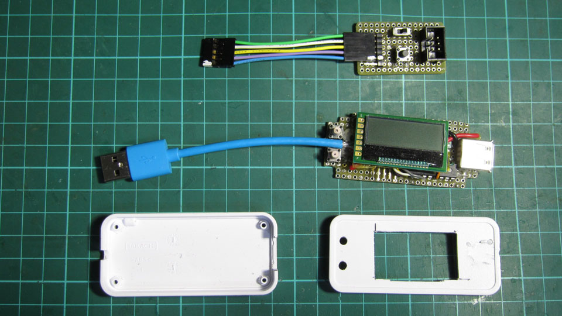
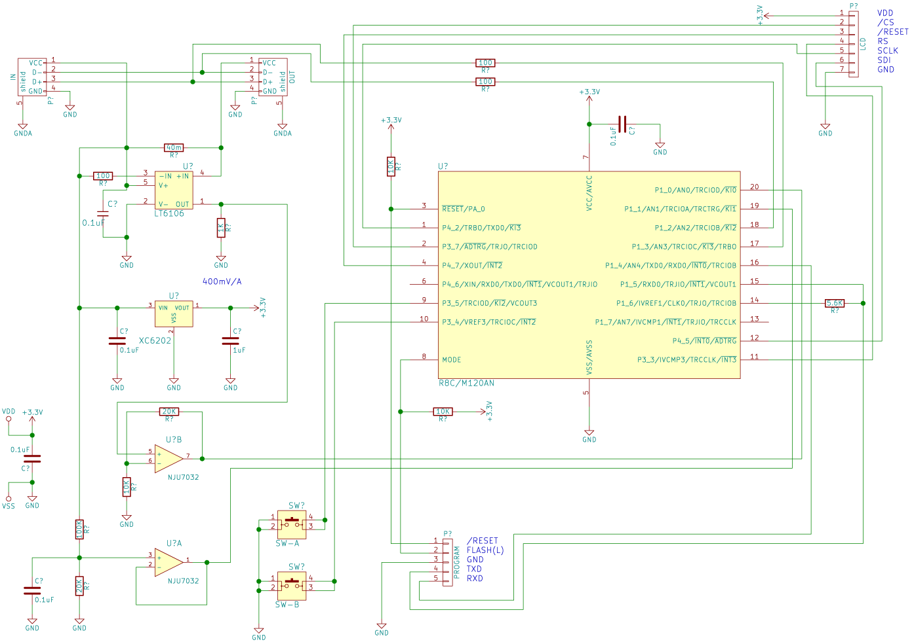

USB 電流、電圧チェッカー
=========

## 概要、特徴   

・１００円マイコン、Ｒ８Ｃ／Ｍ１２０ＡＮを使った、ＵＳＢ電圧、電流測定のガジェット   
・回路的には、最大電圧２０Ｖ程度まで対応可能   
・ハードウェアー、ソフトウェアーを全て公開しているので、自分の欲しい機能を追加可能   
※ケースに入れる為、フラッシュプログラム時の機能を別基板にしている   
   
## R8C/M120AN について

・このマイコンは、メーカー発表とは異なる仕様になっており、非常に高機能です   
※メーカー発表では、フラッシュ２Ｋバイト、ワークＲＡＭ２５６バイト   
・実際には、フラッシュ６４Ｋバイト、ワークＲＡＭ１３６６バイトを利用可能   
・独自実装したフラッシュプログラマーで書き込む事で、隠し領域をプログラムできます   
※「独自実装」と言っても、単に領域に制限を設けないだけで、プロトコルは、標準的なものを使っています   
※「rxprog」を参照、Windows、OS-X、Linux で利用可能
   
## 標準的部品リスト

(1) R8C/M120AN   
(2) LT6106（ハイサイド電流検出）   
(3) XC6202（３．３Ｖリニアレギュレーター）   
(4) 40ミリオーム抵抗（電流検出用）   
(5) AQM1248A-RN（１２８×４８ピクセル、グラフィックス液晶）   
(6) NJU7032D（オペアンプ）   
(7) プッシュ・スイッチ２個   
(8) コンデンサ、抵抗など   
(9) CS75N（タカチ電機工業）   
※ケースを除いて、秋月電子通商で入手可能、詳細は KiCAD ディレクトリー内の回路を参照の事。   
   
## R8C/M120AN ポート利用表
・P4_2(1):   LCD_SCK(SCL)   
・P3_7(2):   LCD_/CS   
・/RES(3):  (System reset)   
・P4_7(4):   LCD_/RES   
・VSS:(5)   (Power GND)   
・P4_6(6):   
・VCC(7):   (Power +3.3V)   
・MODE(8):  (System mode) Flash program for 'L'   
・P3_5(9):   SW-A    
・P3_4(10):  SW-B   
・P3_3(11):  LCD_A0   
・P4_5(12):  LCD_SDA   
・P1_7(13):   
・P1_6(14):  (System RXD) Flash program for 'RXD'   
・P1_5(15):  RXD0   
・P1_4(16):  TXD0   
・P1_3(17):  AN3 USB D+（＋信号電圧測定） 
・P1_2(18):  AN2 USB D-（－信号電圧測定）  
・P1_1(19):  AN1 voltage sense (19.8V max)   
・P1_0(20):  AN0 current sense (1.2 V/A)   
   
## 回路図

※回路図プロジェクトは「KiCAD」ディレクトリーを参照

## 主な機能

・電流、電圧表示   
・経過時間、積算電力表示（リセット可能）
・グラフ表示   
・電流、電圧変化の記録と表示   
   
---
License

MIT
