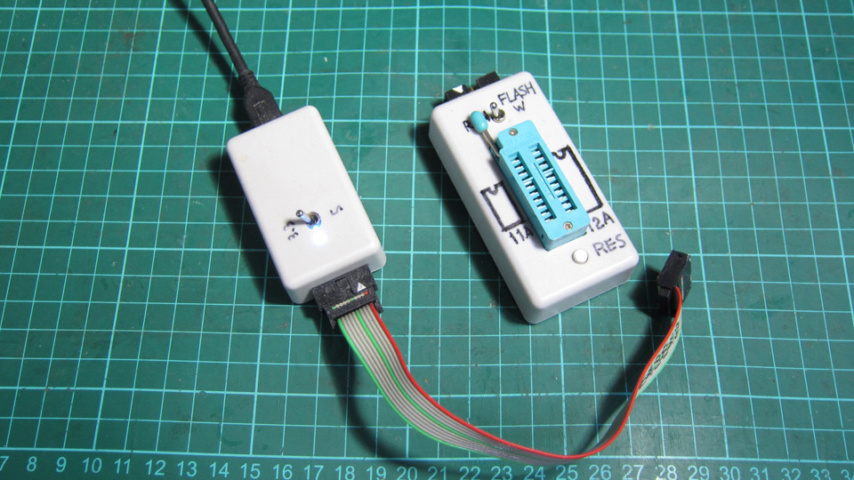

R8C Programmer
=========


## R8C プログラマーの概要など

「r8c_prog」は、R8C 全般のフラッシュメモリーを書き換える為のプログラムです。   
通常は、シリアル通信を使ってデバイスと通信を行います。   
※１本の通信線を使って、デバイスと通信するプロトコルはサポートしていま   
せんが、ハードウェアーを追加する事により、サポートできる場合があります。   
   
以下は、コマンドライン上で表示される簡単なヘルプ機能です。   
```
Renesas R8C Series Programmer Version 0.82b
Copyright (C) 2015, Hiramatsu Kunihito (hira@rvf-rc45.net)
usage:
r8c_prog[options] [mot file] ...

Options :
-d, --device=DEVICE             Specify device name
-e, --erase                     Perform a device erase to a minimum
    --erase-all, --erase-chip   Perform rom and data flash erase
    --erase-rom                 Perform rom flash erase
    --erase-data                Perform data flash erase
-i, --id=xx:xx:xx:xx:xx:xx:xx   Specify protect ID
-P, --port=PORT                 Specify serial port
-a, --area=ORG,END              Specify read area
-r, --read                      Perform data read
-s, --speed=SPEED               Specify serial speed
-v, --verify                    Perform data verify
    --device-list               Display device list
-V, --verbose                   Verbose output
-w, --write                     Perform data write
    --progress                  display Progress output
-h, --help                      Display this
```
R8C フラッシュメモリーのほぼ全ての機能を設定する事ができます。   
   
また、「r8c_prog.conf」ファイルを読み込む事で、標準的な設定や、デバイス   
固有の設定を拡張して、色々なデバイスに対応可能です。   

--- 
## オプションの詳細
   
 - --device 


---
   
License
---

MIT
